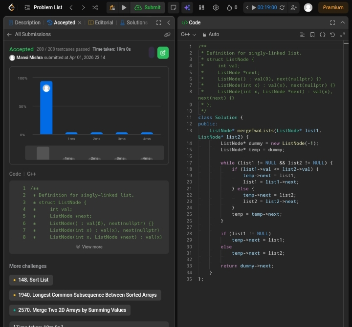

Day 11 – ACM POTD

🧩 Merge two sorted lists

- Description :
Merge two sorted linked lists by comparing nodes one by one and attaching the smaller node to a new list. Continue until one list ends, then attach the remaining nodes. The result is a single sorted linked list.

---

## Screenshot



---

## Code
```cpp
class Solution {
public:
    ListNode* mergeTwoLists(ListNode* list1, ListNode* list2) {
        ListNode* dummy = new ListNode(-1);
        ListNode* temp = dummy;

        while (list1 != NULL && list2 != NULL) {
            if (list1->val <= list2->val) {
                temp->next = list1;
                list1 = list1->next;
            } else {
                temp->next = list2;
                list2 = list2->next;
            }
            temp = temp->next;
        }

        if (list1 != NULL)
            temp->next = list1;
        else
            temp->next = list2;

        return dummy->next;
    }
};
```
---

 Time Complexity: O(n)
