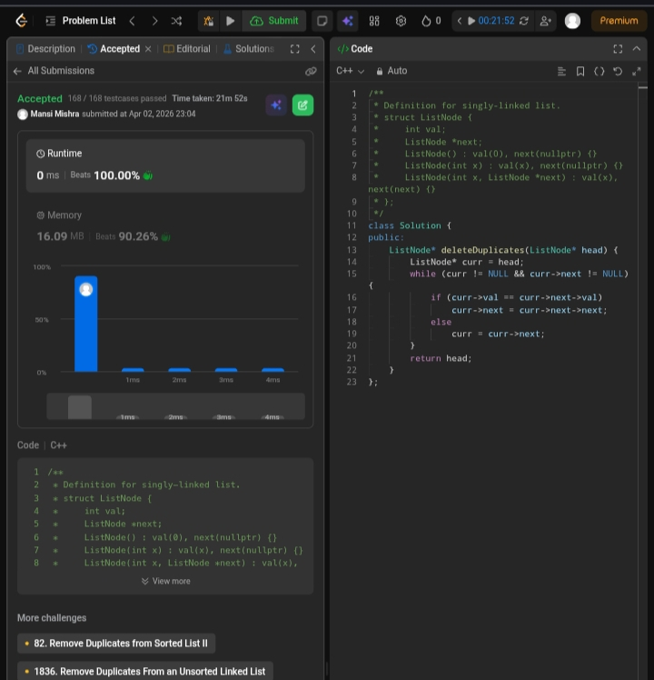

Day 12 – ACM POTD

🧩 Remove Duplicates from sorted list

- Description :
Removes duplicate nodes from a sorted linked list by comparing each node with the next and skipping duplicates.
---

## Screenshot



---

## Code
```cpp
class Solution {
public:
    ListNode* deleteDuplicates(ListNode* head) {
        ListNode* curr = head;
        while (curr != NULL && curr->next != NULL) {
            if (curr->val == curr->next->val)
                curr->next = curr->next->next;
            else
                curr = curr->next;
        }
        return head;
    }
};
```
---

 Time Complexity: O(n)
