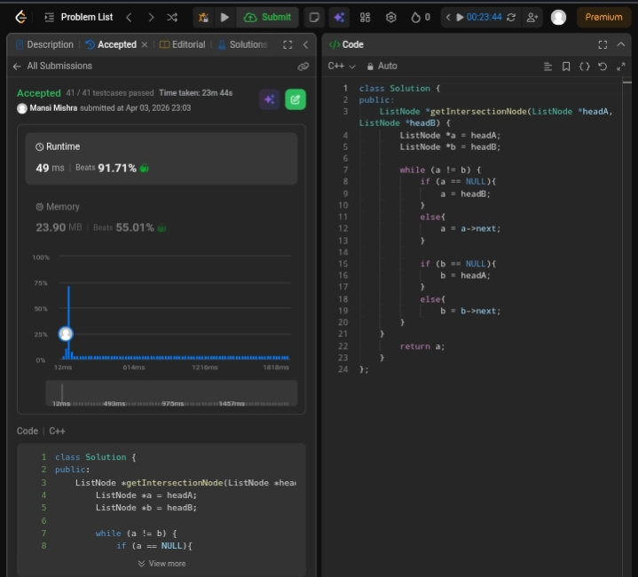

Day 13 – ACM POTD

🧩 Intersection of two linked lists

- Description :
Find the node where two singly linked lists intersect. If no intersection exists, return NULL.

---

## Screenshot



---

## Code
```cpp
class Solution {
public:
    ListNode *getIntersectionNode(ListNode *headA, ListNode *headB) {
        ListNode *a = headA;
        ListNode *b = headB;

        while (a != b) {
            if (a == NULL){
                a = headB;
               }
            else{
                a = a->next;
              }
            if (b == NULL){
                b = headA;
              }
            else{
                b = b->next;
             }
        }
        return a;
    }
};
```
