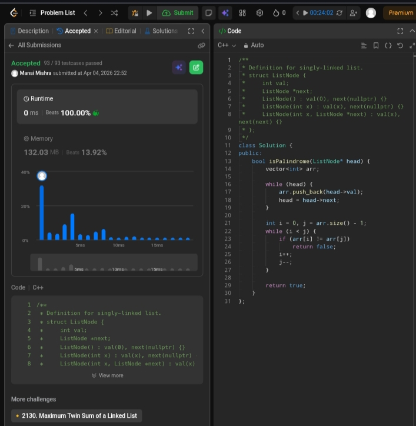

Day 14 – ACM POTD

🧩 Palindrome linked list

- Description :
Store values in array and use two pointers to check palindrome.

---

## Screenshot



---

## Code
```cpp
class Solution {
public:
    bool isPalindrome(ListNode* head) {
        vector<int> arr;

        while (head) {
            arr.push_back(head->val);
            head = head->next;
        }

        int i = 0, j = arr.size() - 1;
        while (i < j) {
            if (arr[i] != arr[j])
                return false;
            i++;
            j--;
        }

        return true;
    }
};
```
