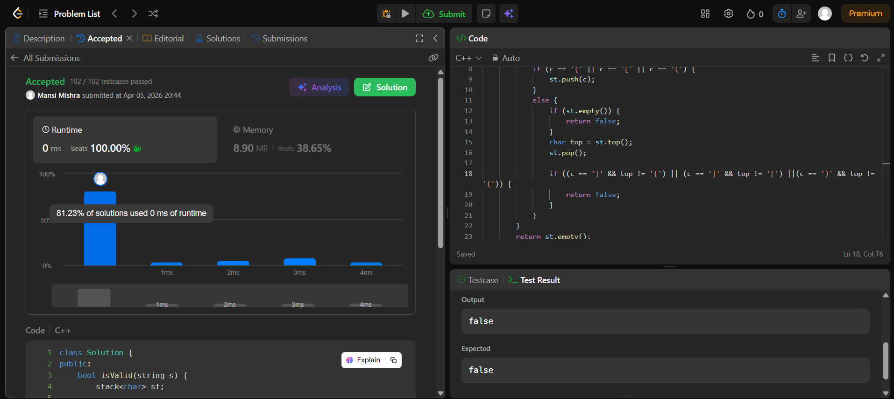

Day 15 – ACM POTD

🧩 Valid Parentheses

- Description :
push opening brackets, match each closing bracket with top.
If mismatch or stack empty → false; if stack empty at end → true.

---

## Screenshot



---

## Code
```cpp
class Solution {
public:
    bool isValid(string s) {
        stack<char> st;

        for (int i = 0; i < s.length(); i++) {
            char c = s[i];
            if (c == '{' || c == '[' || c == '(') {
                st.push(c);
            }
            else {
                if (st.empty()) {
                    return false;
                }
                char top = st.top();
                st.pop();

                if ((c == '}' && top != '{') || (c == ']' && top != '[') ||(c == ')' && top != '(')) {
                    return false;
                }
            }
        }
        return st.empty();
    }
};
```
