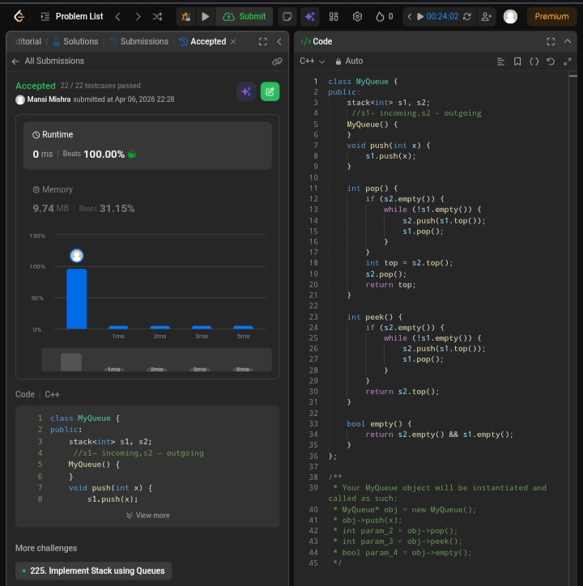

Day 16 – ACM POTD

🧩 Implement Queue using stacks

- Description :
 Elements are pushed into one stack and transferred to another to reverse order, enabling FIFO behavior.

---

## Screenshot



---

## Code
```cpp
class MyQueue {
public:
    stack<int> s1, s2;
    MyQueue() {
    }
    void push(int x) {
        s1.push(x);
    }   
    int pop() {
        if (s2.empty()) {
            while (!s1.empty()) {
                s2.push(s1.top());
                s1.pop();
            }
        }
        int top = s2.top();
        s2.pop();
        return top;
    }    
    int peek() {
        if (s2.empty()) {
            while (!s1.empty()) {
                s2.push(s1.top());
                s1.pop();
            }
        }
        return s2.top();
    }
    bool empty() {
        return s2.empty() && s1.empty();
    }
};
```
