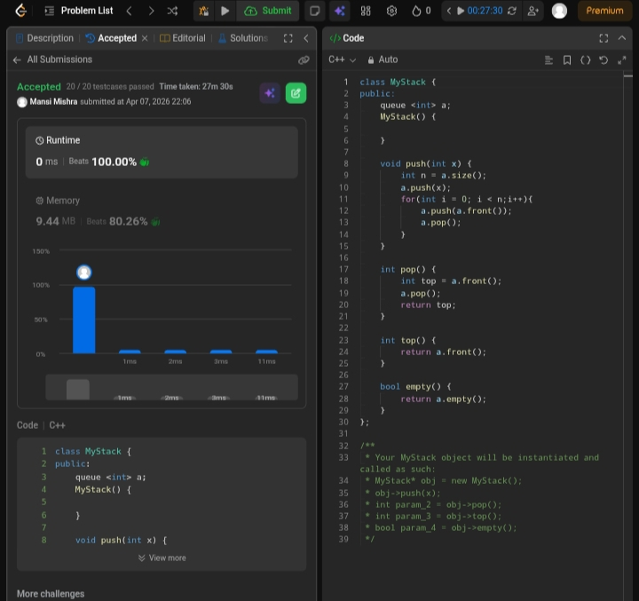

Day 17 – ACM POTD

🧩 Implement Stack using Queue

- Description :
 Use one queue. After pushing an element, rotate previous elements to bring the new element to the front, making it behave like a stack (LIFO).
---

## Screenshot



---

## Code
```cpp
class MyStack {
public:
    queue <int> a;
    MyStack() {
        
    }
    void push(int x) {
        int n = a.size();
        a.push(x);
        for(int i = 0; i < n;i++){
            a.push(a.front());
            a.pop();
        }
    } 
    int pop() {
        int top = a.front();
        a.pop();
        return top;
    } 
    int top() {
        return a.front();
    } 
    bool empty() {
        return a.empty();
    }
};
```
