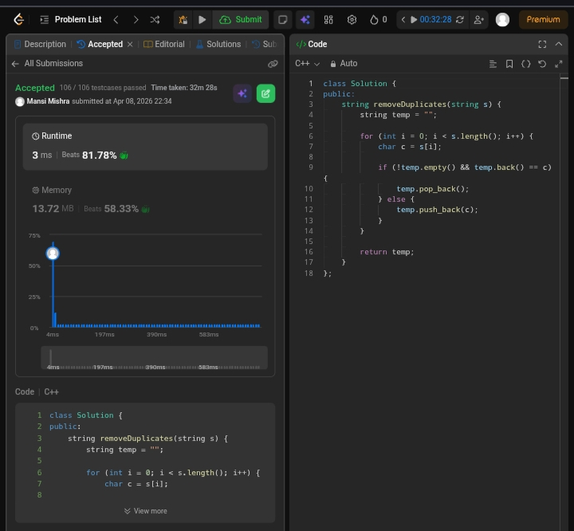

Day 18 – ACM POTD

🧩 Remove all adjacent duplicate from string

- Description :
Removes adjacent duplicate characters by comparing each character with the last inserted one and updating the result accordingly.

---

## Screenshot



---

## Code
```cpp
class Solution {
public:
    string removeDuplicates(string s) {
        string temp = "";
        for (int i = 0; i < s.length(); i++) {
            char c = s[i];
            if (!temp.empty() && temp.back() == c) {
                temp.pop_back();
            } else {
                temp.push_back(c);
            }
        }
        return temp;
    }
};
```
