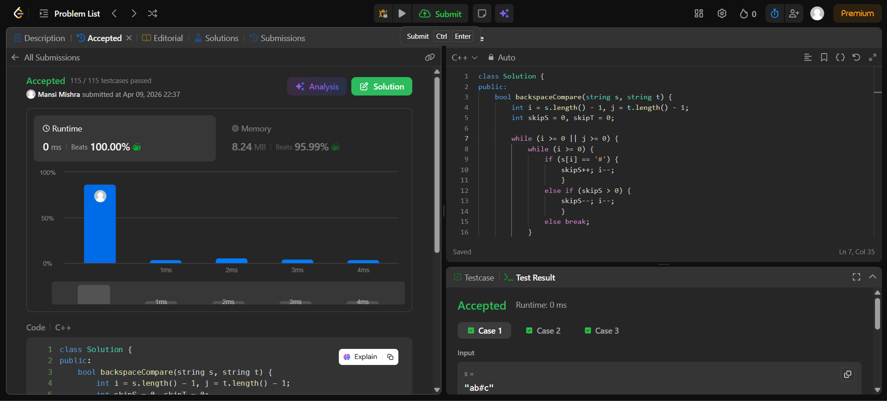

Day 19 – ACM POTD

🧩 Backspace String Compare

- Description :
Traverse both strings from the end using two pointers. Skip characters affected by # using counters, and compare valid characters.
Return true if all match, otherwise false.

---

## Screenshot



---

## Code
```cpp
class Solution {
public:
    bool backspaceCompare(string s, string t) {
        int i = s.length() - 1, j = t.length() - 1;
        int skipS = 0, skipT = 0;

        while (i >= 0 || j >= 0) {
            while (i >= 0) {
                if (s[i] == '#') { 
                    skipS++; i--; 
                    }
                else if (skipS > 0) { 
                    skipS--; i--; 
                    }
                else break;
            }
            while (j >= 0) {
                if (t[j] == '#') { 
                    skipT++; j--; 
                    }
                else if (skipT > 0) { 
                    skipT--; j--; 
                    }
                else break;
            }

            if (i >= 0 && j >= 0 && s[i] != t[j]) {
                return false;
            }
            if ((i >= 0) != (j >= 0)) {
                return false;
            }
            i--; j--;
        }
        return true;
    }
};
```
