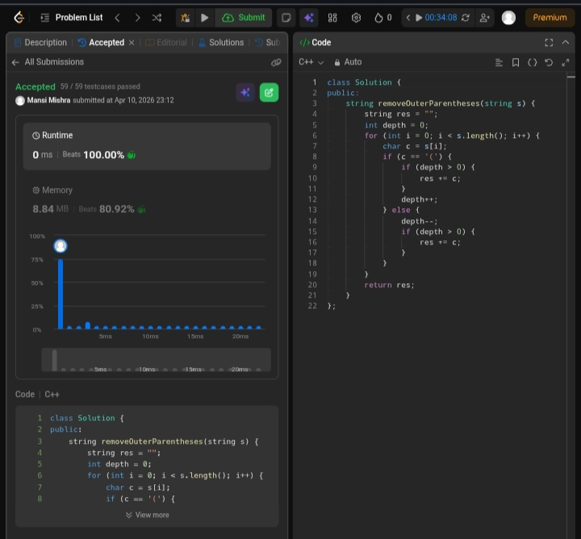

Day 20 – ACM POTD

🧩 Remove Outermost Parentheses 

- Description :
Uses a depth counter to track nesting and skips adding outermost parentheses, keeping only inner valid parts.

---

## Screenshot



---

## Code
```cpp
class Solution {
public:
    string removeOuterParentheses(string s) {
        string res = "";
        int depth = 0;

        for (int i = 0; i < s.length(); i++) {
            char c = s[i];
            if (c == '(') {
                if (depth > 0) {
                    res += c;
                }
                depth++;
            } else {
                depth--;
                if (depth > 0) {
                    res += c;
                }
            }
        }
        return res;
    }
};
```
