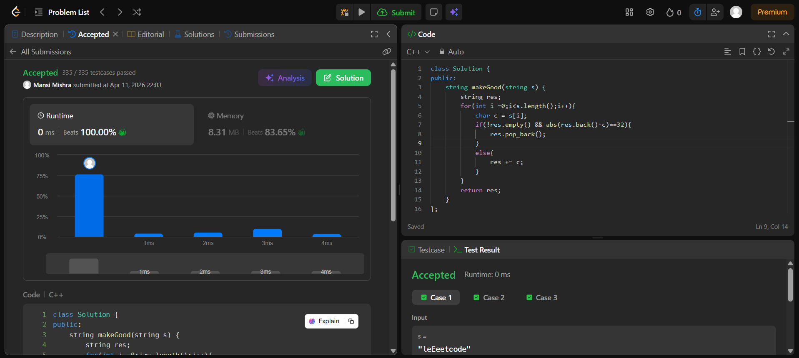

Day 21 – ACM POTD

🧩 Make The String Great

- Description :
Removes adjacent same letters in opposite cases using a stack-like approach.
---

## Screenshot



---

## Code
```cpp
  class Solution {
public:
    string makeGood(string s) {
        string res;
        for(int i =0;i<s.length();i++){
            char c = s[i];
            if(!res.empty() && abs(res.back()-c)==32){
                res.pop_back();
            }
            else{
                res += c;
            }
        }
        return res;
    }
};
```
