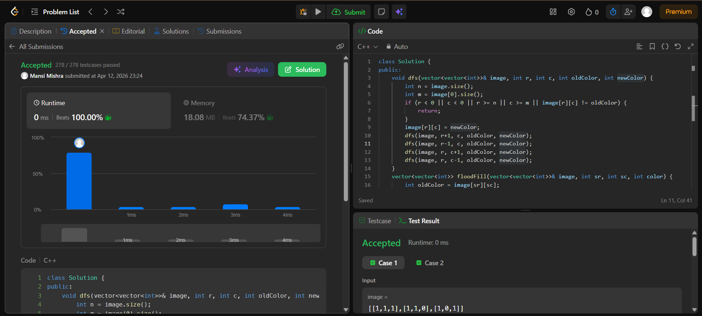

Day 22 – ACM POTD

🧩 Flood Fill

- Description :
Flood Fill changes the color of a starting pixel and all its connected pixels with the same color using DFS.
---

## Screenshot



---

## Code
```cpp
  class Solution {
public:
    void dfs(vector<vector<int>>& image, int r, int c, int oldColor, int newColor) {
        int n = image.size();
        int m = image[0].size();
        if (r < 0 || c < 0 || r >= n || c >= m || image[r][c] != oldColor) {
            return;
        }
        image[r][c] = newColor;
        dfs(image, r+1, c, oldColor, newColor);
        dfs(image, r-1, c, oldColor, newColor);
        dfs(image, r, c+1, oldColor, newColor);
        dfs(image, r, c-1, oldColor, newColor);
    }
    vector<vector<int>> floodFill(vector<vector<int>>& image, int sr, int sc, int color) {
        int oldColor = image[sr][sc];
        if (oldColor == color) {
            return image;}
        dfs(image, sr, sc, oldColor, color);
        return image;
    }
};
```
