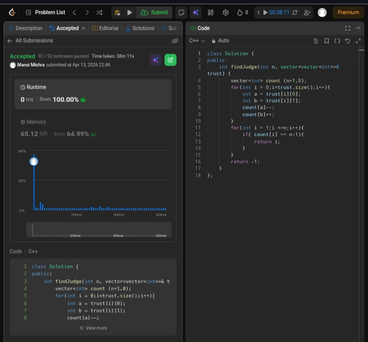

Day 23 – ACM POTD

🧩 Find the Town Head

- Description :
 Track trust balance of each person and return the one trusted by all but trusts none.

---

## Screenshot



---

## Code
```cpp
  lass Solution {
public:
    int findJudge(int n, vector<vector<int>>& trust) {
        vector<int> count (n+1,0);
        for(int i = 0;i<trust.size();i++){
            int a = trust[i][0];
            int b = trust[i][1];
            count[a]--;
            count[b]++;
        }
        for(int i = 1;i <=n;i++){
            if( count[i] == n-1){
                return i;
            }
        }
        return -1;      
    }
};
```
