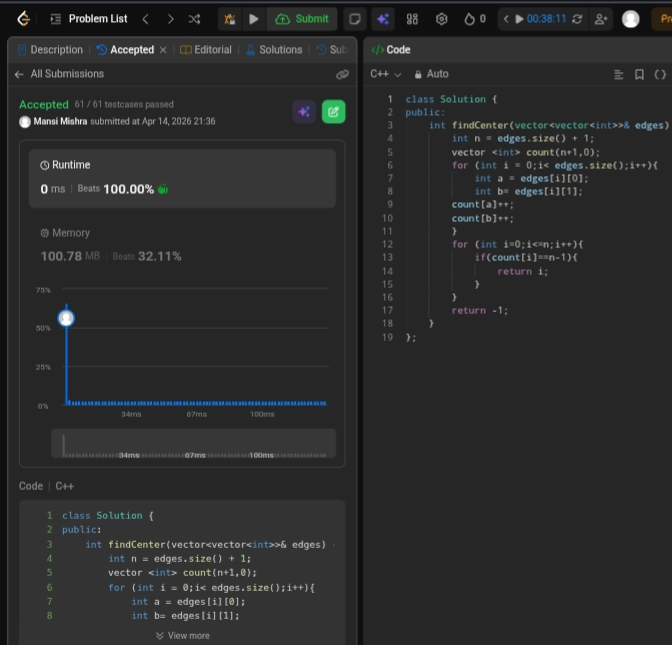

Day 24 – ACM POTD

🧩 Find Centre of Star Graph

- Description :
 The code finds the center of a star graph by counting how often each node appears in the edges and returning the node that appears the most.
---

## Screenshot



---

## Code
```cpp
  class Solution {
public:
    int findCenter(vector<vector<int>>& edges) {
        int n = edges.size() + 1;
        vector <int> count(n+1,0);
        for (int i = 0;i< edges.size();i++){
            int a = edges[i][0];
            int b= edges[i][1];
        count[a]++;
        count[b]++;
        }
        for (int i=0;i<=n;i++){
            if(count[i]==n-1){
                return i;
            }
        }
        return -1;
    }
};
```
