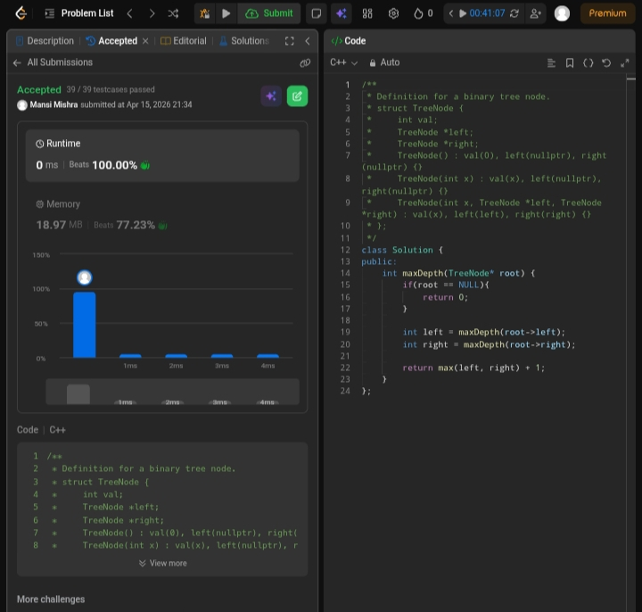

Day 25 – ACM POTD

🧩 Maximum Depth of Binary Tree

- Description :
Calculates tree height by comparing left and right subtree depths.

---

## Screenshot



---

## Code
```cpp
  class Solution {
public:
    int maxDepth(TreeNode* root) {
        if(root == NULL){
            return 0;
        }
        int left = maxDepth(root->left);
        int right = maxDepth(root->right);
        return max(left, right) + 1;
    }
};
```
