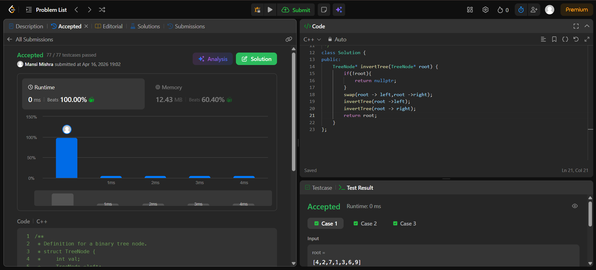

Day 26 – ACM POTD

🧩 Invert Binary Tree

- Description :
swap the roots of the binary treee using swap function.

---

## Screenshot



---

## Code
```cpp
  class Solution {
public:
    TreeNode* invertTree(TreeNode* root) {
        if(!root){
            return nullptr;
        }
        swap(root -> left,root ->right);
        invertTree(root ->left);
        invertTree(root -> right);
        return root;
    }
};
```
