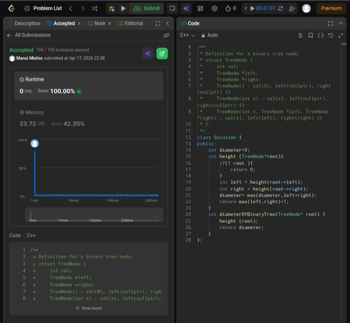

Day 27 – ACM POTD

🧩 Diameter of a Binary Tree

- Description :
Recursive function that returns height of the tree and updates diameter at each node.
---

## Screenshot



---

## Code
```cpp
  class Solution {
public:
    int diameter=0;
    int height (TreeNode*root){
        if(! root ){
            return 0;
        }
        int left = height(root->left);
        int right = height(root->right);
        diameter= max(diameter,left+right);
        return max(left,right)+1;
    }
    int diameterOfBinaryTree(TreeNode* root) {
        height (root);
        return diameter;
    } 
};
```
