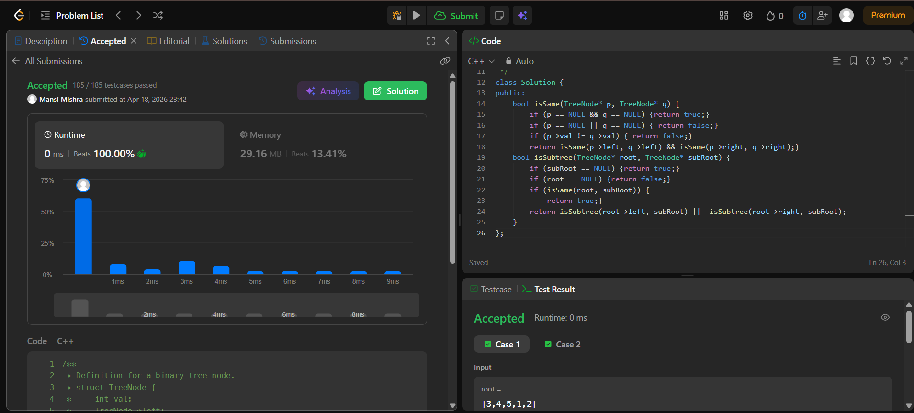

Day 28 – ACM POTD

🧩 Subtree of Another Tree

- Description :
Try every node of root and check if the subtree starting there matches subRoot.
---

## Screenshot



---

## Code
```cpp
  class Solution {
public:
    bool isSame(TreeNode* p, TreeNode* q) {
        if (p == NULL && q == NULL) {return true;}
        if (p == NULL || q == NULL) { return false;}
        if (p->val != q->val) { return false;}
        return isSame(p->left, q->left) && isSame(p->right, q->right);}
    bool isSubtree(TreeNode* root, TreeNode* subRoot) {
        if (subRoot == NULL) {return true;}
        if (root == NULL) {return false;}
        if (isSame(root, subRoot)) { 
            return true;}
        return isSubtree(root->left, subRoot) ||  isSubtree(root->right, subRoot);
    }
};
```
