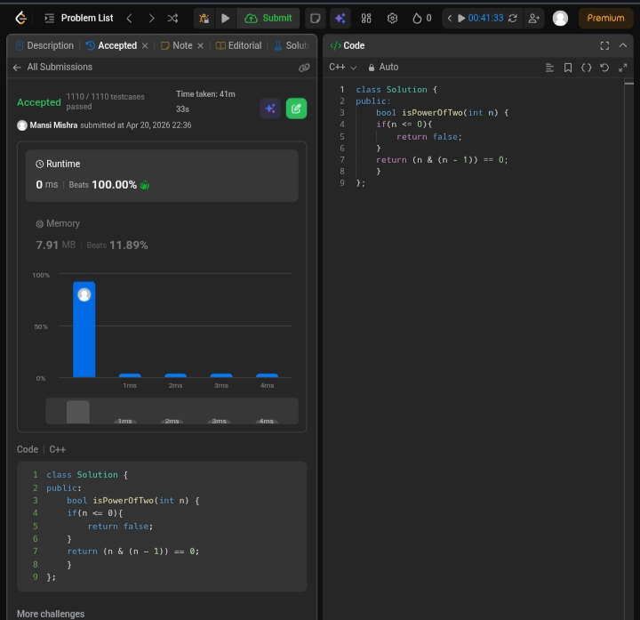

Day 30 – ACM POTD

🧩 Power of two

- Description :
Uses the property that a power of 2 has only one set bit, so (n & (n - 1)) == 0 confirms it.
---

## Screenshot



---

## Code
```cpp
  class Solution {
public:
    bool isPowerOfTwo(int n) {
    if(n <= 0){
        return false;
    }
    return (n & (n - 1)) == 0;
    }
};
```
