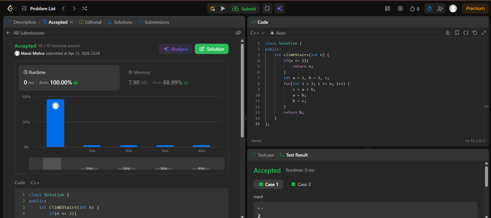

Day 31 – ACM POTD

🧩 Climbing Stairs

- Description :
Uses Fibonacci pattern.
---

## Screenshot



---

## Code
```cpp
  class Solution {
public:
    int climbStairs(int n) {
        if(n <= 2){
            return n;
        }       
        int a = 1, b = 2, c;       
        for(int i = 3; i <= n; i++) {
            c = a + b;
            a = b;
            b = c;
        }    
        return b;
    }
};
```
