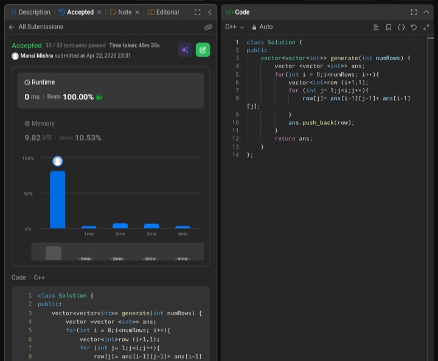

Day 32 – ACM POTD

🧩 Pascal's Triangle 

- Description :
Pascal’s Triangle is built row by row, where each element is the sum of the two elements directly above it. The first and last elements of every row are always 1, forming the triangle shape.
---

## Screenshot



---

## Code
```cpp
  class Solution {
public:
    vector<vector<int>> generate(int numRows) {
        vector<vector<int>> ans;
        for(int i = 0; i < numRows; i++) {
            vector<int> row(i + 1, 1);
            for(int j = 1; j < i; j++) {
                row[j] = ans[i-1][j-1] + ans[i-1][j];
            }
            ans.push_back(row);
        }
        return ans;
    }
};
```
