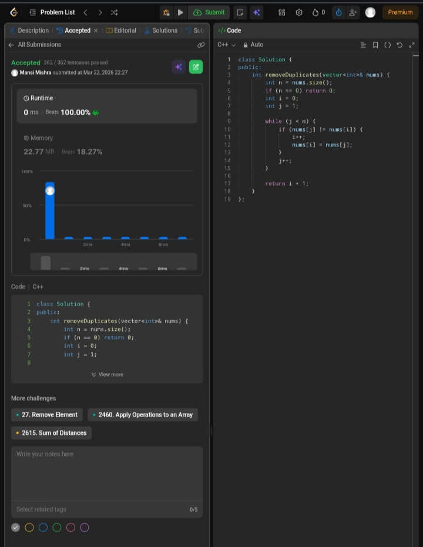

📅 Day 1 – ACM POTD

 Remove Duplicates from Sorted Array

📝 Description

Removes duplicate elements from a sorted array in-place using a two-pointer approach.

---

🖼️ Screenshot



---

##💻 Code
```cpp
class Solution {
public:
    int removeDuplicates(vector<int>& nums) {
        int n = nums.size();
        if (n == 0) return 0;

        int i = 0;
        int j = 1;

        while (j < n) {
            if (nums[j] != nums[i]) {
                i++;
                nums[i] = nums[j];
            }
            j++;
        }

        return i + 1;
    }
};
```
---

 Time Complexity: O(n)
