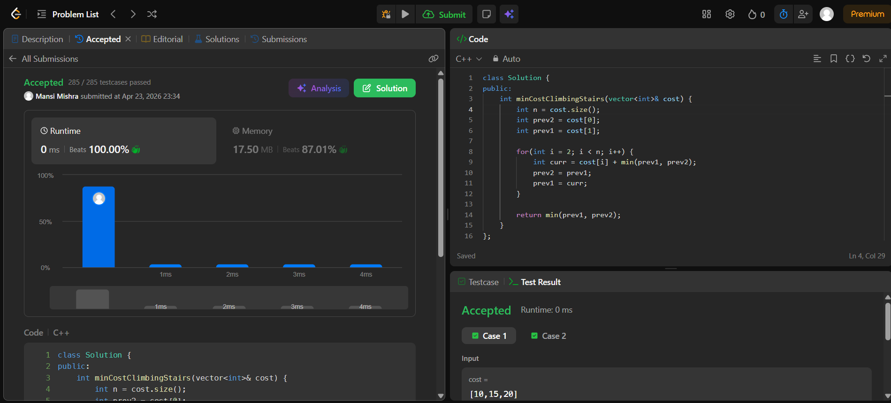

Day 33 – ACM POTD

🧩 Min Cost Climbing Stairs

- Description :
It keeps track of the minimum cost of the previous two steps (prev1, prev2) and updates the current cost accordingly.

---

## Screenshot



---

## Code
```cpp
  class Solution {
public:
    int minCostClimbingStairs(vector<int>& cost) {
        int n = cost.size();
        int prev2 = cost[0];
        int prev1 = cost[1];
        for(int i = 2; i < n; i++) {
            int curr = cost[i] + min(prev1, prev2);
            prev2 = prev1;
            prev1 = curr;
        }
        return min(prev1, prev2);
    }
};
```
