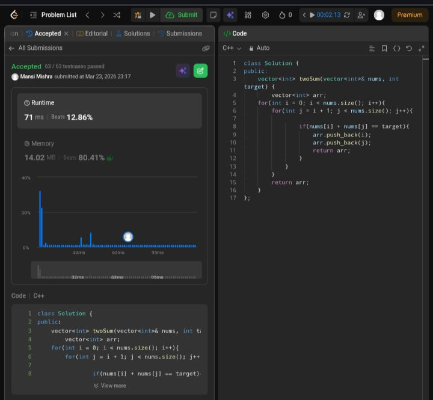

Day 2 – ACM POTD

🧩 Two Sum

- Description :
Find two indices such that their elements add up to the target using a brute-force approach.
---

## Screenshot



---

## Code
```cpp
class Solution {
public:
    vector<int> twoSum(vector<int>& nums, int target) {
        vector<int> arr;

for(int i = 0; i < nums.size(); i++){
for(int j = i + 1; j < nums.size(); j++){
 if(nums[i] + nums[j] == target){
                   arr.push_back(i);
                    arr.push_back(j);
                    return arr;
                }
            }
        }
        return arr;
    }
};
```
---

 Time Complexity: O(n²)
