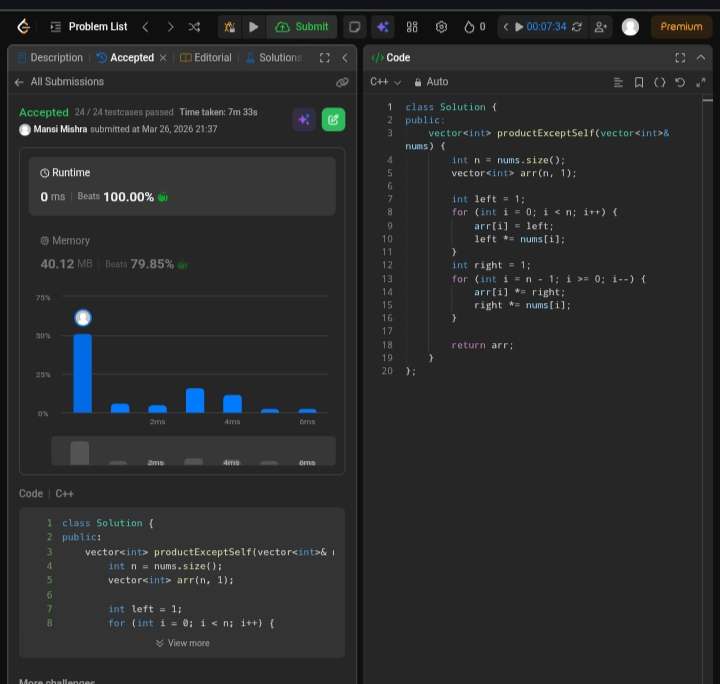

Day 5 – ACM POTD

🧩 Product of Array Except Self

- Description :
Given an array containing n distinct numbers in the range [0, n], find the one number that is missing from the array.
This solution uses the XOR approach, which efficiently finds the missing number by cancelling out common elements.
---

## Screenshot



---

## Code
```cpp
class Solution {
public:
    vector<int> productExceptSelf(vector<int>& nums) {
        int n = nums.size();
        vector<int> arr(n, 1);

        int left = 1;
        for (int i = 0; i < n; i++) {
            arr[i] = left;
            left *= nums[i];
        }
        int right = 1;
        for (int i = n - 1; i >= 0; i--) {
            arr[i] *= right;
            right *= nums[i];
        }
        return arr;
    }
};
```
---

 Time Complexity: O(n)
