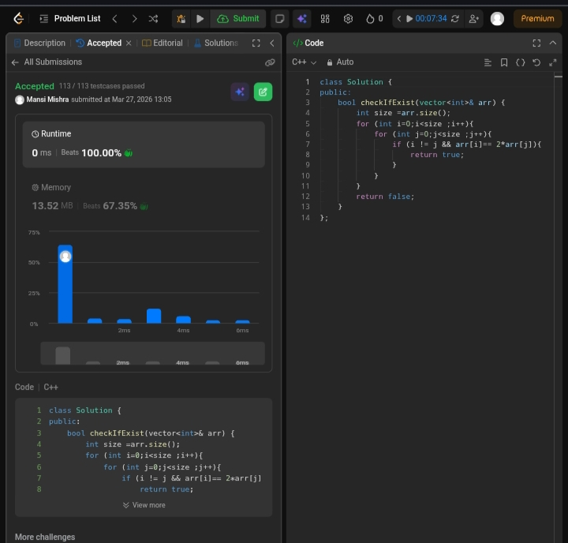

Day 6 – ACM POTD

🧩 Check if N and its Double Exist

- Description :
Given an array nums, compute a new array where each element is the product of all other elements except itself, without using division.
This solution first store the product of elements before each index, then multiply it with the product of elements after each index, achieving an O(n) time solution.
---

## Screenshot



---

## Code
```cpp
class Solution {
public:
    bool checkIfExist(vector<int>& arr) {
        int size =arr.size();
        for (int i=0;i<size ;i++){
            for (int j=0;j<size ;j++){
                if (i != j && arr[i]== 2*arr[j]){
                    return true;
                }
            }
        }
        return false;
    }
};
```
---

 Time Complexity: O(n²)
