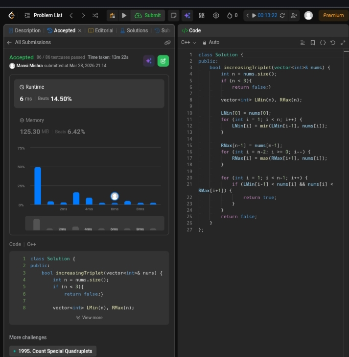

Day 7 – ACM POTD

🧩 Increasing Triplet Subsequence

- Description :
Given an array, check if any two different elements exist such that one is double the other. The solution uses two nested loops to compare all pairs and returns true if arr[i] == 2 * arr[j]; otherwise, it returns false.
---

## Screenshot



---

## Code
```cpp
class Solution {
public:
    bool increasingTriplet(vector<int>& nums) {
        int n = nums.size();
        if (n < 3){
            return false;}

        vector<int> LMin(n), RMax(n);

        LMin[0] = nums[0];
        for (int i = 1; i < n; i++) {
            LMin[i] = min(LMin[i-1], nums[i]);
        }

        RMax[n-1] = nums[n-1];
        for (int i = n-2; i >= 0; i--) {
            RMax[i] = max(RMax[i+1], nums[i]);
        }

        for (int i = 1; i < n-1; i++) {
            if (LMin[i-1] < nums[i] && nums[i] < RMax[i+1]) {
                return true;
            }
        }
        return false;
    }
};
```
---

 Time Complexity: O(n)
