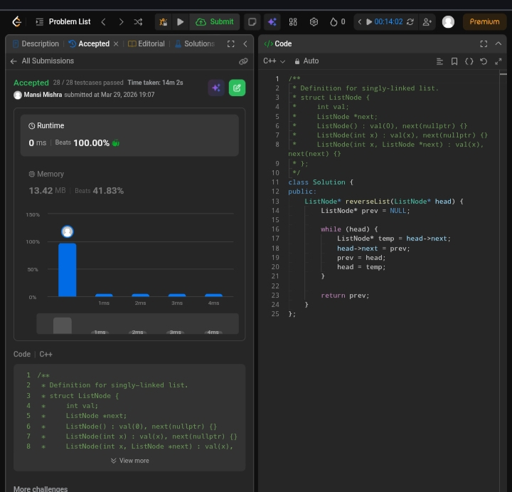

Day 8 – ACM POTD

🧩 Reverse Linked List

- Description :
The solution checks if there exists an Reverse the linked list by iterating through nodes and changing each node’s next pointer to its previous node using a prev pointer. The final prev becomes the new head.
---

## Screenshot



---

## Code
```cpp
class Solution {
public:
    ListNode* reverseList(ListNode* head) {
        ListNode* prev = NULL;

        while (head) {
            ListNode* temp = head->next;
            head->next = prev;
            prev = head;
            head = temp;
        }

        return prev;
    }
};
```
---

 Time Complexity: O(n)
