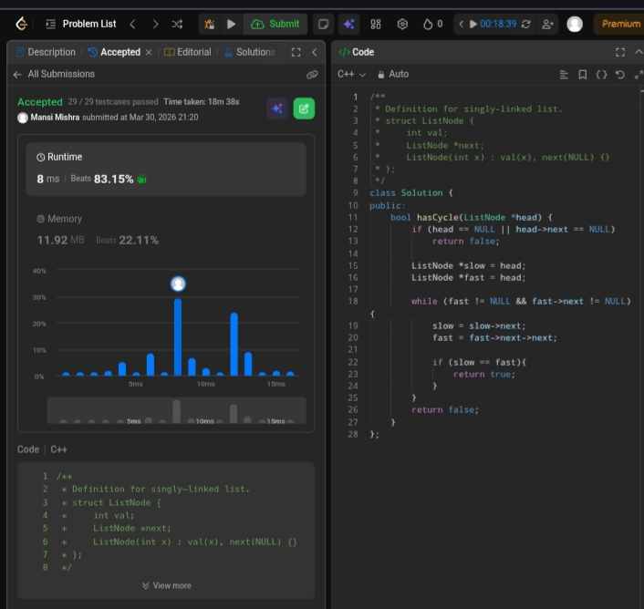

Day 9 – ACM POTD

🧩 Linked List Cycle

- Description :
This solution uses two pointers (slow and fast) to detect a cycle in a linked list. The slow pointer moves one step at a time while the fast pointer moves two steps. If a cycle exists, both pointers will eventually meet; otherwise, the fast pointer reaches NULL, indicating no cycle.
---

## Screenshot



---

## Code
```cpp
class Solution {
public:
    bool hasCycle(ListNode *head) {
        if (head == NULL || head->next == NULL)
            return false;

        ListNode *slow = head;
        ListNode *fast = head;

        while (fast != NULL && fast->next != NULL) {
            slow = slow->next;
            fast = fast->next->next;

            if (slow == fast){
                return true;
             }
        }

        return false;
    }
};
```
---

 Time Complexity: O(n)
