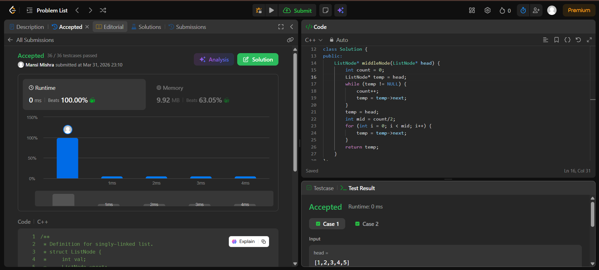

Day 10 – ACM POTD

🧩 Middle of Linked List 

- Description :
The middle of a linked list is found by first counting the total number of nodes. Then, traverse the list again up to count/2 to reach the middle node.
---

## Screenshot



---

## Code
```cpp
class Solution {
public:
    ListNode* middleNode(ListNode* head) {
        int count = 0;
        ListNode* temp = head;
        while (temp != NULL) {
            count++;
            temp = temp->next;
        }
        temp = head;
        int mid = count/2;
        for (int i = 0; i < mid; i++) {
            temp = temp->next;
        }
        return temp;
    }
};
```
---

 Time Complexity: O(n)
